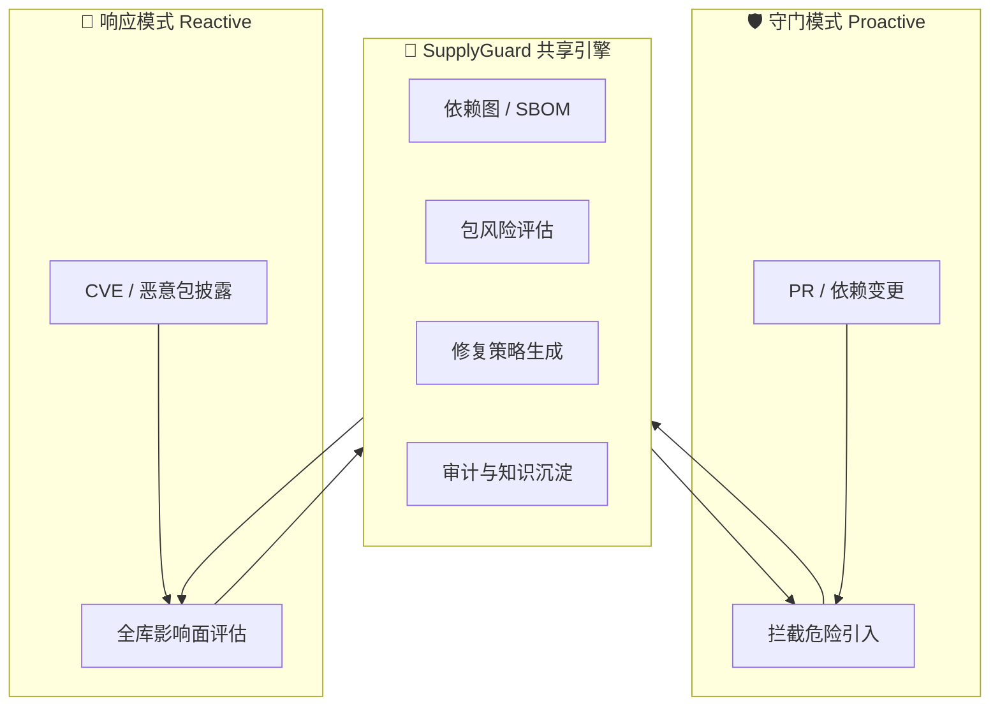
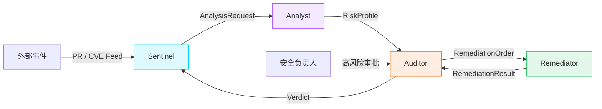
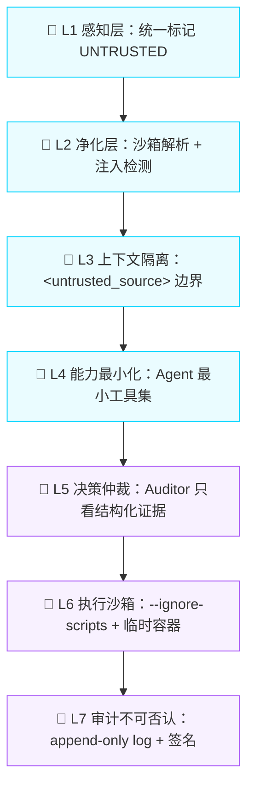

# SupplyGuard

> 面向 AI 编程时代的多 Agent 供应链安全防御系统。既在 PR 时刻拦下危险依赖（含 AI 幻觉包），也在零日事件披露时刻自动完成全库影响面评估与缓解修复。

## 参赛背景

| 项目 | 内容 |
| --- | --- |
| **赛事** | GOAI 2026 Infra 赛道 —— 企业级复杂任务下的多 Agent 基础设施与协同系统 |
| **官网** | <https://www.goaihz.com/tracks?track=infra> |
| **初赛截止** | 2026-08-16 |
| **复赛** | 2026-08-25 ~ 2026-09-03 |
| **决赛** | 2026-09-22 |
| **必选技术** | AgentTeams（原 Hiclaw）多 Agent 框架、Skill 抽象层 |
| **推荐技术** | 阿里云 Skills / Nacos / Higress / PolarDB PG / RocketMQ / LoongSuite / MCP |

## 项目定位

供应链攻击是当下企业软件最真实、最贵、也最被忽视的风险源。而 AI 编程工具的普及带来了一类全新的攻击面：**LLM 会"幻觉"出并不存在的包名，攻击者会抢注这些名字**（slopsquatting）。传统 SCA/DevSecOps 工具是围绕人写的代码设计的，在 AI 生成代码的时代节奏跟不上、决策不够智能。

SupplyGuard 试图用多 Agent 系统解决这道题：把守门（proactive）与响应（reactive）两个不同触发时刻合并到一套共享引擎里，让 Agent 承担分析、决策、修复与审计的全闭环。



## 双入口一引擎

| 入口 | 触发时刻 | 目标 |
| --- | --- | --- |
| **守门模式** | PR / 依赖变更 | 拦下危险引入、AI 幻觉包、恶意脚本、license 冲突 |
| **响应模式** | 上游 CVE / 恶意包披露 | 全库扫描、影响面评估、生成缓解 PR、自动降级/替换 |

两条链路共享同一套底层能力：依赖图与 SBOM 建模、包风险评估、修复策略生成、审计与知识沉淀。

## 多 Agent 架构



| Agent | HiClaw 角色 | 核心职责 | 关键 Skill | 安全边界 |
| --- | --- | --- | --- | --- |
| **Sentinel** | Manager Agent | 事件路由、任务拆分、状态机推进、打 UNTRUSTED 标签 | `policy-check` | 不做安全判断、不写代码 |
| **Analyst** | Worker Agent | 只读分析、多信号融合、输出 RiskProfile | `sbom-build`、`cve-match`、`hallucination-check`、`maintainer-profile`、`license-check`、`risk-profile`、`reachability-scan` | 只读、不能开 PR |
| **Auditor** | Worker（仲裁特权） | 终局裁决、审计留痕、人工审批 | `policy-check`、`evidence-verify`、`human-approval-request`、`audit-log-write` | 不看 untrusted 原文 |
| **Remediator** | Worker Agent | 修复策略落地、开 PR、沙箱验证 | `bump-version`、`swap-dependency`、`quarantine-package`、`sandbox-test-run` | 不能 merge、只沙箱运行 |

上下文传递协议：`AnalysisRequest` → `RiskProfile` → `RemediationOrder` → `RemediationResult` → `Verdict`

任务状态机：`received → analyzing → arbitrating → remediating → verifying → sealed`

## 洋葱式安全架构

SupplyGuard 的工作对象本身可能是恶意的。Agent 读取包 README、CVE 描述、commit message 来做决策，恶意包可以嵌入 prompt injection 操纵 Agent。



这是 Agent 化供应链安全产品相对传统 SCA 工具的结构性差异。

## Skill 工程体系

13 个 Skill 按数据层 → 信号层 → 融合层 → 修复层 → 验证层 → 治理层分层解耦。

| 层级 | Skill | 用途 |
| --- | --- | --- |
| **数据层** | `sbom-build` | 解析 lockfile，构建依赖图与 SBOM 快照 |
| **信号层** | `cve-match` | CVE / 漏洞 / 恶意包匹配 |
| | `hallucination-check` | AI 幻觉包 / slopsquatting 检测 |
| | `maintainer-profile` | 维护者与发布行为画像 |
| | `license-check` | 许可证冲突检测 |
| **融合层** | `risk-profile` | 多信号融合，输出 RiskProfile |
| **修复层** | `bump-version` | 版本升级修复 |
| | `swap-dependency` | 依赖替换 |
| | `quarantine-package` | 恶意包隔离 |
| | `patch-gen` | 补丁生成 |
| **验证层** | `sandbox-test-run` | 沙箱测试验证 |
| | `reachability-scan` | 漏洞可达性分析 |
| **治理层** | `policy-check` | 组织策略检查 |
| | `evidence-verify` | 证据校验 |
| | `audit-log-write` | 审计日志写入 |
| | `human-approval-request` | 人工审批触发 |

### Skill 与 Agent 关系矩阵

| Agent | 直接调用 Skill |
| --- | --- |
| Sentinel | `policy-check`（轻量路由策略） |
| Analyst | `sbom-build`、`cve-match`、`hallucination-check`、`maintainer-profile`、`license-check`、`risk-profile`、`reachability-scan` |
| Remediator | `bump-version`、`swap-dependency`、`quarantine-package`、`sandbox-test-run` |
| Auditor | `policy-check`、`evidence-verify`、`human-approval-request`、`audit-log-write` |

## 技术栈

| 层级 | v1（初赛） | 复赛 / 生产 |
| --- | --- | --- |
| **多 Agent 框架** | 本地 `LocalOrchestrator` | AgentTeams / HiClaw |
| **数据层** | SQLite + JSONB | PolarDB for PostgreSQL |
| **向量 / RAG** | SQLite + pgvector | PolarDB + pgvector |
| **审计日志** | SQLite append-only | PolarDB append-only |
| **消息队列** | 内存队列 | RocketMQ |
| **配置治理** | 本地 YAML | Nacos |
| **AI 网关** | 直接调用 | Higress |
| **可观测** | stdout / Jaeger | AgentLoop / LoongSuite |
| **MCP 工具** | GitHub、npm registry、OSV、CI Trigger、Approval Gateway | — |

## 项目状态

**v0.3：能力补齐阶段**（在 v0.2 骨架基础上落地）。

| 模块 | 状态 | 说明 |
| --- | --- | --- |
| 参赛方向与场景确认 | ✅ | 供应链安全 + AI slopsquatting |
| 解决方案架构 | ✅ | 双入口一引擎 + 洋葱式安全防御 |
| 多 Agent 角色分工 | ✅ | Sentinel / Analyst / Remediator / Auditor |
| 核心 Skill 清单 | ✅ | 13 个 Skill，含输入输出与失败降级 |
| 可运行骨架代码 | ✅ | Python 3.10+，44 个测试通过 |
| 已落地 Skill | ✅ | `hallucination-check`、`cve-match`、`risk-profile`、`sbom-build`、`license-check` |
| 审计日志 | ✅ | append-only + HMAC 签名哈希链 |
| 可观测 | ✅ | 结构化 JSON 日志 + span trace |
| 洋葱 L2/L3 | ✅ | prompt-injection 检测 + 零宽字符剥离 |
| HiClaw adapter | ✅ | 骨架已准备 |
| 初赛提交材料 | ✅ | 500 字简介 + 方案 PPT |
| AgentTeams/HiClaw 真实接入 | ⏳ | 待 hello-world 验证 |
| 复赛完整 Demo | ⏳ | 第二段：零日 CVE 响应 |

> 依赖已收敛：移除未使用的 `sqlalchemy` / `pgvector`（v1 用内存审计日志 + 结构化日志；RAG / 共享状态为复赛 TODO）。

## 目录结构

```
GoAISpace/
├── README.md                              # 本文件
├── pyproject.toml                         # Python 项目配置
├── requirements.txt                       # 依赖
├── docs/
│   ├── specs/
│   │   └── 2026-08-10-supplyguard-design.md   # 设计文档 v0.2
│   ├── demo/                              # Demo 输出样例
│   └── 初赛作品简介.md                      # 500 字作品简介
├── 初赛提交材料/                           # 初赛提交材料
│   ├── 01-作品简介.md
│   ├── 02-方案PPT.pdf
│   └── README.md
├── agents/                                # Agent Identity 与 K8s pod 模板
│   ├── sentinel/
│   ├── analyst/
│   ├── remediator/
│   └── auditor/
├── src/supplyguard/                       # 核心实现
│   ├── agents/                            # 4 个 Agent
│   ├── skills/                            # Skill 实现
│   ├── mcp/                               # MCP 等效工具层 + 工具契约
│   ├── models/                            # 消息与状态 Schema
│   ├── runtime/                           # 本地编排器 + HiClaw adapter 骨架
│   ├── audit/                             # append-only 签名审计日志
│   ├── security/                          # 洋葱 L2/L3（injection detector）
│   ├── observability.py                   # 结构化日志 + span trace
│   └── demo/                              # Demo 场景
├── ppt/                                   # 网页版方案 PPT（reveal.js）
└── tests/                                 # 单元测试（44 例）
```

## 本地运行

### 环境要求

- Python 3.10+
- （可选）npm registry 网络访问；Demo 在离线时会回退到本地相似度匹配

### 安装

```bash
uv venv
uv pip install -r requirements.txt
uv pip install -e .
```

### 运行 Demo：Slopsquatting / 幻觉包拦截

```bash
python src/supplyguard/demo/slopsquatting_guard.py
```

或直接使用 uv run：

```bash
uv run python src/supplyguard/demo/slopsquatting_guard.py
```

该 Demo 模拟一次 PR 事件：AI 生成的代码引入了名为 `lodos` 的包（`lodash` 的 typosquat / 幻觉）。
SupplyGuard 会按以下链路执行：

| 步骤 | Agent | 动作 |
| --- | --- | --- |
| 1 | **Sentinel** | 接收 PR 事件，给外部内容打 `UNTRUSTED` 标签 |
| 2 | **Analyst** | 调用 `hallucination-check` Skill 查询 npm registry 并做相似度匹配 |
| 3 | **Analyst** | 调用 `risk-profile` Skill 融合信号 |
| 4 | **Auditor** | 根据 RiskProfile 裁决 `block` |
| 5 | **Remediator** | 生成阻止性 comment |
| 6 | **Auditor** | 写入审计摘要 |

预期输出见 [docs/demo/slopsquatting_guard_output.md](docs/demo/slopsquatting_guard_output.md)。

### 运行测试

```bash
uv run pytest tests/
```

## 与 AgentTeams / HiClaw 的关系

- 业务层（Agent 逻辑、Skill、MCP 适配）与编排层解耦
- 当前使用 `LocalOrchestrator` 在进程内模拟多 Agent 编排
- 验证 HiClaw hello-world 后，通过 adapter 替换为真实 AgentTeams runtime
- Agent Identity 文件已按 HiClaw 的 `identity.yaml + pod-template.yaml` 形式准备

## 评审维度对齐

| 评审维度 | 权重 | 本方案如何命中 |
| --- | --- | --- |
| **场景价值与行业可复制性** | 25% | 供应链安全是 universal 痛点；AI 编程时代新增 slopsquatting 攻击面 |
| **多 Agent 协同与自主闭环能力** | 25% | 4 个 Agent 职责清晰；双入口完整闭环；上下文传递、状态机、人工审批、审计回滚 |
| **Skill 工程体系与生态复用** | 25% | 13 个 Skill 卡片，每个含输入输出、调用条件、失败处理、安全边界、复用价值 |
| **工程落地、运行验证与安全可审计** | 20% | 洋葱式 7 层安全架构；Demo 可运行；审计日志 append-only；可观测 Trace+Log |
| **开放 / 开源贡献** | 5% | Skill 设计天然可复用；方案规划开源协议；Agent Identity 文件结构化 |

## 快速链接

- 设计文档：[docs/specs/2026-08-10-supplyguard-design.md](docs/specs/2026-08-10-supplyguard-design.md)
- Demo 预期输出：[docs/demo/slopsquatting_guard_output.md](docs/demo/slopsquatting_guard_output.md)
- 初赛提交材料：[初赛提交材料/](初赛提交材料/)
- 网页版 PPT：[ppt/index.html](ppt/index.html)
- AgentTeams 官网：<https://hiclaw.io/>

## License

待定。倾向 Apache-2.0（对齐赛道"开放/开源贡献"评分维度）。
