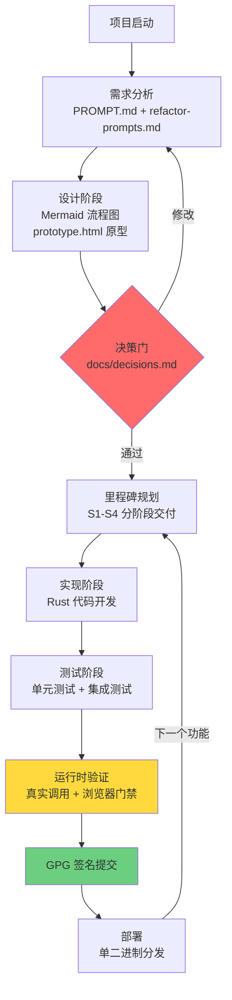
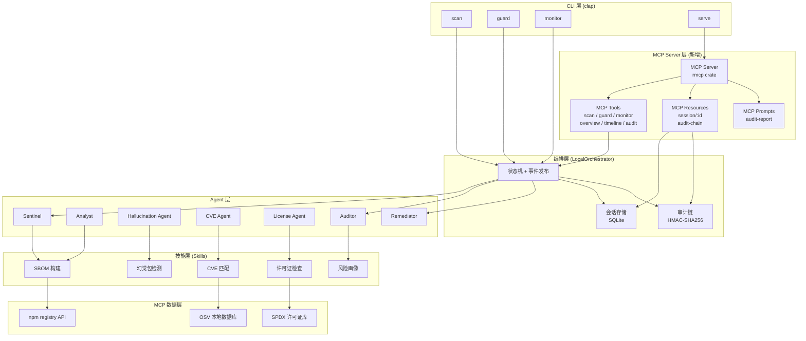
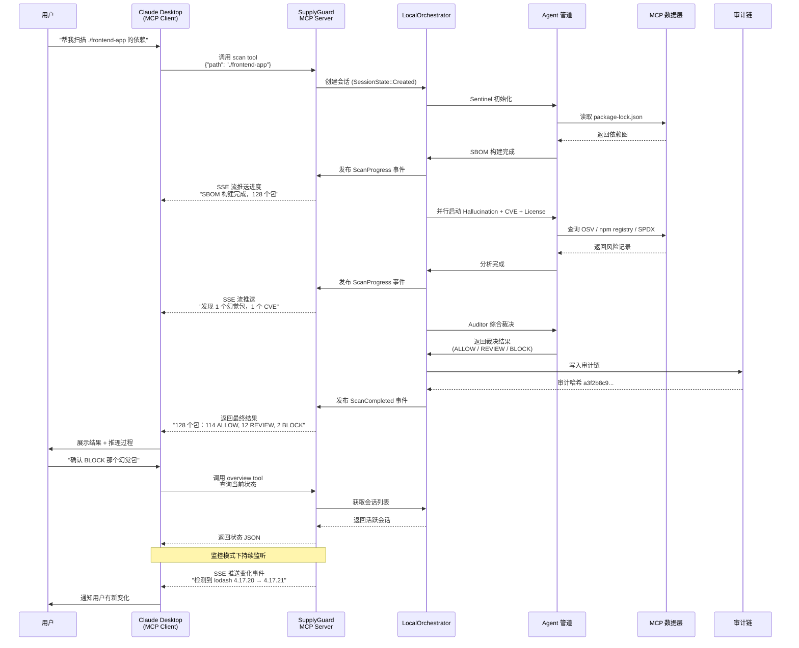
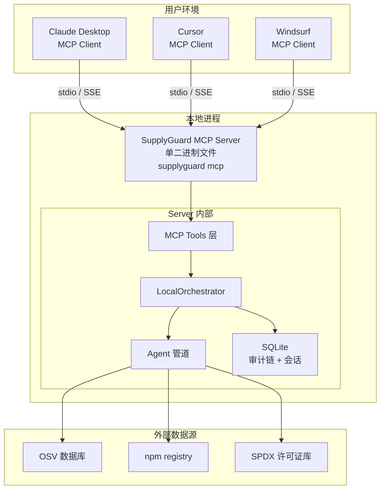
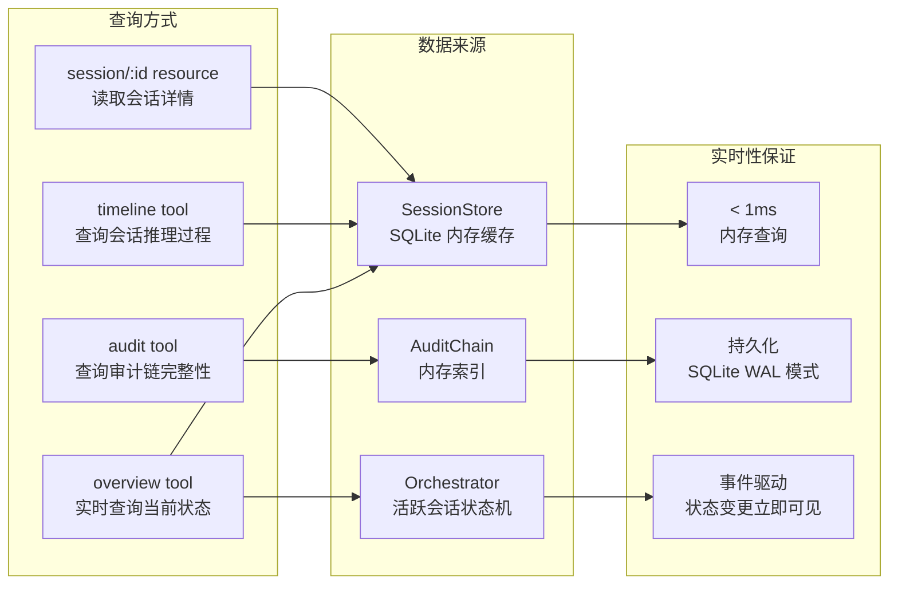
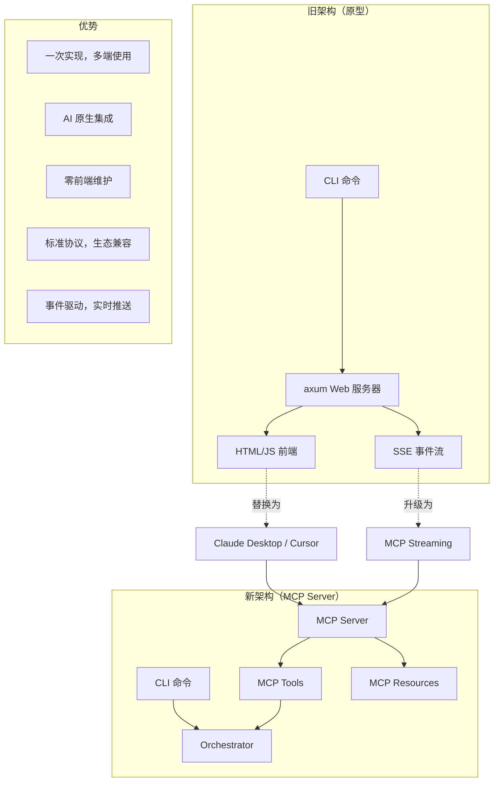
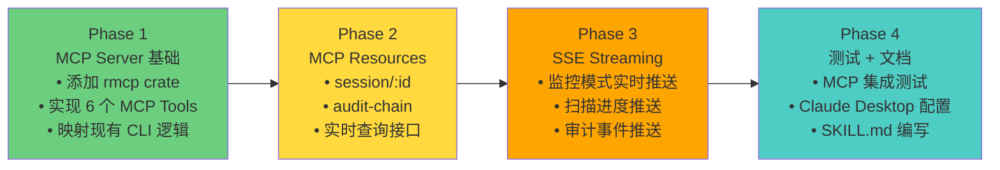

# SupplyGuard 项目流程与调用链路

> 版本：v1.0（2026-09-02）

---

## 1. 开发工作流（Design → Code → Deploy）



---

## 2. SupplyGuard 功能模块依赖图



---

## 3. MCP 调用链路（完整生命周期）



---

## 4. MCP Tools 定义（API 契约）

```mermaid
flowchart LR
    subgraph "MCP Tools"
        scan[scan<br/>输入: path, include_dev<br/>输出: session_id, status]
        guard[guard<br/>输入: diff_path<br/>输出: session_id, verdicts]
        monitor[monitor<br/>输入: path, auto_analyze, notify<br/>输出: session_id, status<br/>实时推送: SSE]
        overview[overview<br/>输入: 无<br/>输出: sessions[], stats]
        timeline[timeline<br/>输入: session_id<br/>输出: events[]]
        audit[audit<br/>输入: session_id?<br/>输出: chain[], verified]
    end

    subgraph "调用场景"
        S1[用户: "扫描 ./my-app"]
        S2[用户: "对 diff 做守门"]
        S3[用户: "监控 ./my-app 目录"]
        S4[用户: "当前状态如何"]
        S5[用户: "查看上次扫描详情"]
        S6[用户: "审计链是否完整"]
    end

    S1 --> scan
    S2 --> guard
    S3 --> monitor
    S4 --> overview
    S5 --> timeline
    S6 --> audit
```

---

## 5. MCP Resources 定义（数据查询）

```mermaid
flowchart TB
    subgraph "MCP Resources"
        R1[session/:id<br/>会话详情<br/>包含: sbom, verdicts, reasoning]
        R2[audit-chain<br/>完整审计链<br/>包含: entries[], hash_verified]
    end

    subgraph "查询方式"
        Q1[MCP Resource Read<br/>session/scan-20260902-1432]
        Q2[MCP Resource Read<br/>audit-chain]
    end

    Q1 --> R1
    Q2 --> R2

    subgraph "返回示例"
        E1[{
  "session_id": "scan-20260902-1432",
  "state": "sealed",
  "packages": 128,
  "verdicts": {
    "allow": 114,
    "review": 12,
    "block": 2
  },
  "reasoning": "...",
  "audit_hash": "a3f2b8c9..."
}]
        E2[{
  "chain_length": 42,
  "entries": [...],
  "verified": true,
  "last_hash": "c9f5d3e1..."
}]
    end

    R1 --> E1
    R2 --> E2
```

---

## 6. 部署架构（MCP Server 模式）



---

## 7. 状态查询实时性保证



---

## 8. 对比：旧架构 vs 新架构



---

## 9. 实施路线图



---

## 10. 用户使用场景示例

```mermaid
flowchart TD
    U1[用户: "帮我扫描 ./my-app 的依赖安全"] --> Claude1[Claude 调用 scan tool]
    Claude1 --> Result1[Claude 展示 Agent 推理过程<br/>+ 裁决建议]
    Result1 --> User_Decision1[用户确认 BLOCK 幻觉包]
    User_Decision1 --> Audit1[写入审计链]

    U2[用户: "持续监控 ./my-app"] --> Claude2[Claude 调用 monitor tool]
    Claude2 --> Monitor_Start[监控启动]
    Monitor_Start -->|检测到变化| Alert[Claude 推送通知]
    Alert --> User_Review[用户审查推理]
    User_Review --> User_Decision2[用户裁决]
    User_Decision2 --> Audit2[写入审计链]

    U3[用户: "查看审计链是否完整"] --> Claude3[Claude 调用 audit tool]
    Claude3 --> Verify[返回 chain + verified: true]

    U4[用户: "上次扫描的推理过程"] --> Claude4[Claude 调用 timeline tool]
    Claude4 --> Timeline[返回时间线事件]
```
