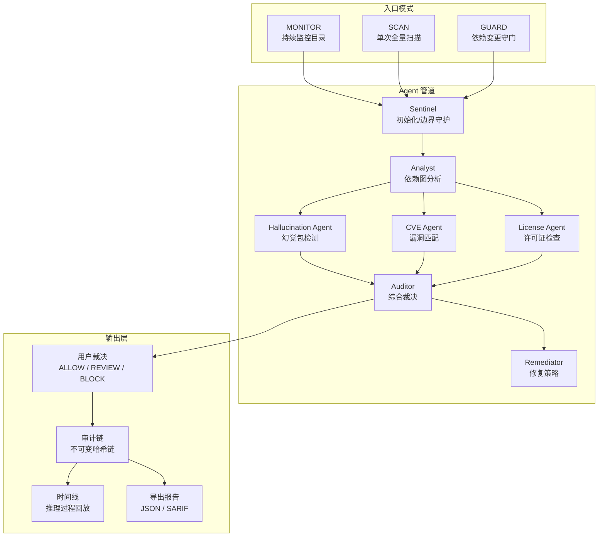
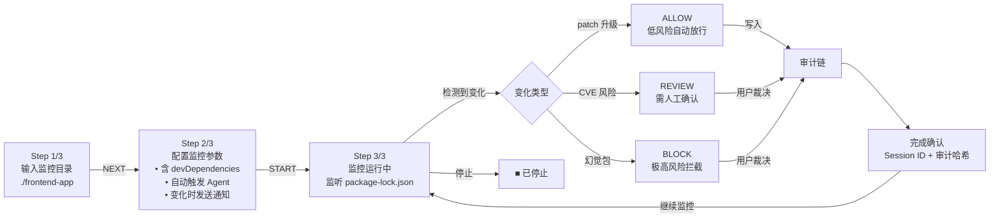
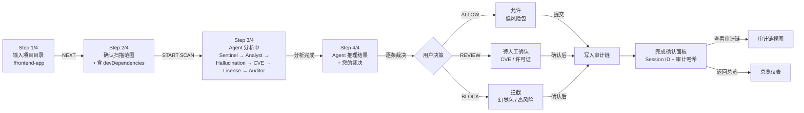
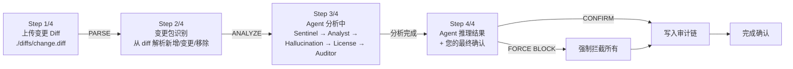
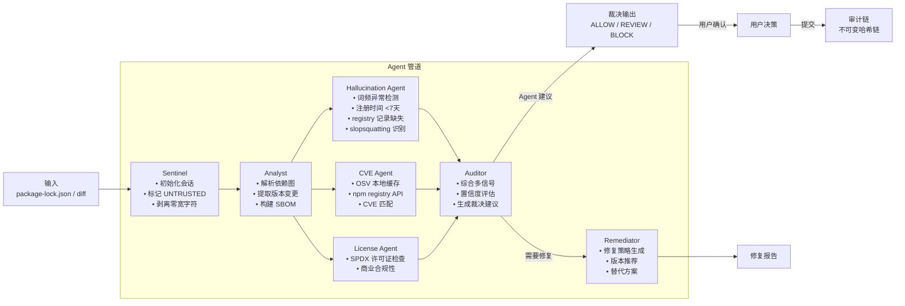
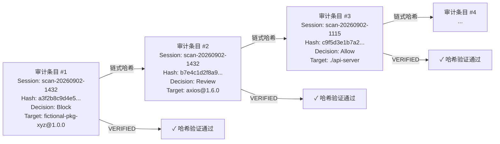
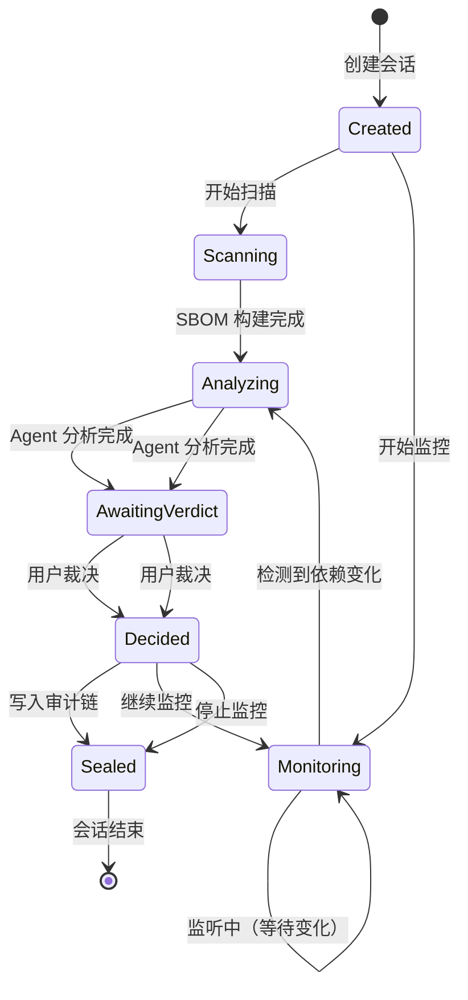
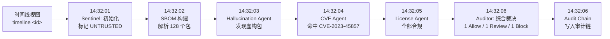
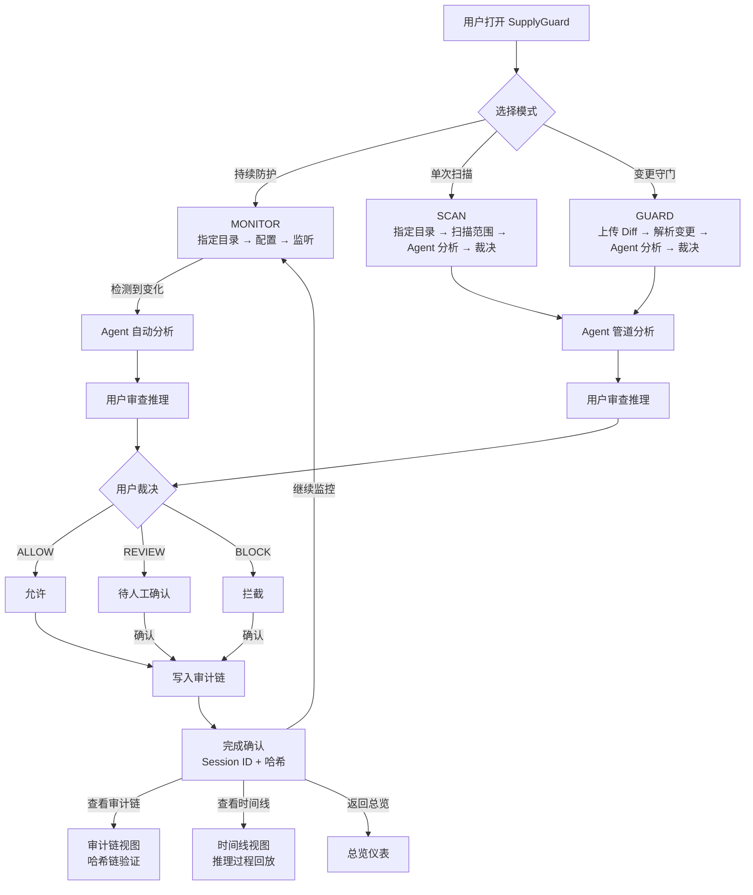
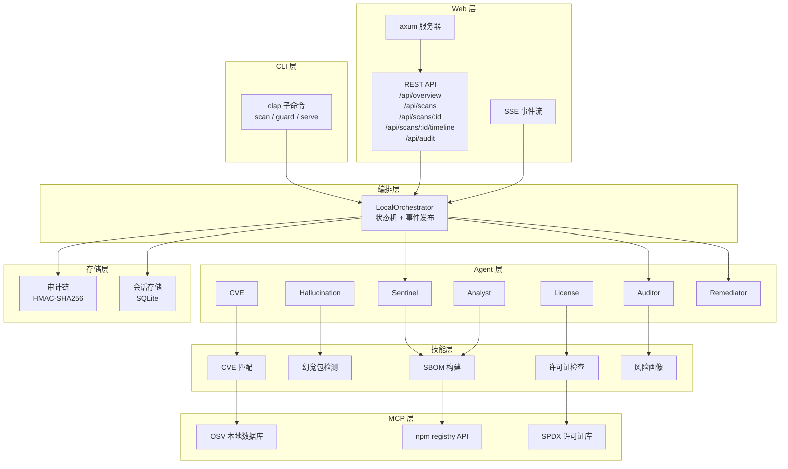

# SupplyGuard 业务流程图

> 版本：v1.0（2026-09-02）
> 说明：以下图表覆盖所有核心业务流程，可用 Mermaid 渲染器（如 VS Code Mermaid Preview、GitHub、Mermaid Live Editor）查看。

---

## 1. 产品总览架构

---

## 2. 监控模式流程（3 步）

---

## 3. 单次扫描流程（4 步）

---

## 4. 守门模式流程（4 步）

---

## 5. Agent 管道详解

---

## 6. 审计链结构

---

## 7. 状态机（Session 生命周期）

---

## 8. 时间线视图（推理过程回放）

---

## 9. 完整用户旅程

---

## 10. 技术架构（后端）

---

## 使用说明

1. **在线查看**：复制任意 Mermaid 代码块到 [Mermaid Live Editor](https://mermaid.live)
2. **VS Code**：安装 [Mermaid Preview](https://marketplace.visualstudio.com/items?itemName=bierner.markdown-mermaid) 扩展
3. **GitHub**：直接渲染（需文件名以 `.mmd` 或 `.md` 结尾，并启用 Mermaid 支持）
